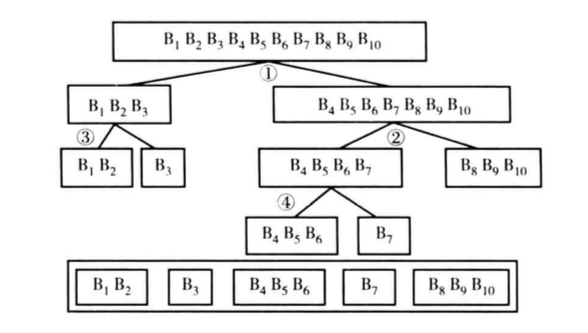

```{r setup, include=FALSE}
options(htmltools.dir.version = FALSE)
```

# 主要内容 

### 1. 评分卡是什么？
### 2. R语言环境配置
### 3. scorecard包的使用

---

class: inverse, center, middle
# 1. 评分卡是什么？

---

## 评分卡相关概念<sup>*</sup>

- **定义**：
信用评分模型运用数据挖掘技术和统计分析方法，通过对消费者的人口特征、信用历史记录、行为记录、交易记录等大量数据进行系统的分析，挖掘数据中蕴含的行为模式、信用特征，捕捉历史信息和未来信用表现之间的关系，发展出预测性的模型，以一个信用评分来综合评估消费者未来的某种信用表现。

--

- **信用评分模型分类**：
  - 金融机构内部数据评分
      - 申请风险评分
      - 行为风险评分、行为收益评分、行为流失倾向评分
      - 申请欺诈评分、交易欺诈评分
  - 征信局数据评分
      - 征信局风险/破产/收益评分、市场反应评分、转账倾向评分

--

- **信用评分模型优点**：
客观性、准确性、效率性

--

.footnote[[*] 陈建. 信用评分模型技术与应用[M]. 中国财政经济出版社, 2005.]

---

## 标准评分卡示例

```{r scorecard_example1, include=FALSE}
library(data.table)
library(scorecard)
data("germancredit")

y = "creditability"
x = c("age.in.years", "housing", "present.employment.since")
breaks_list = list(
  # credit.history = c("no credits taken/ all credits paid back duly%,%all credits at this bank paid back duly", "existing credits paid back duly till now%,%delay in paying off in the past", "critical account/ other credits existing (not at this bank)"), 
  age.in.years = c(26, 35, 40),
  present.employment.since = c("unemployed%,%... < 1 year", "1 <= ... < 4 years", "4 <= ... < 7 years", "... >= 7 years"), 
  housing = NULL
)

dt = setDT(germancredit)[,`:=`(
  creditability = ifelse(creditability=="bad",1,0), 
  housing = as.character(housing)
)][,c(x,y),with=F]


# for (i in seq(0,100,by=10)) {
seed = 40
set.seed(seed)
x = sort(x)

# glm 
  train = split_df(dt, y, ratio=0.6, seed=seed)$train
  test = split_df(dt, y, ratio=0.6, seed=seed)$test
  
  bins_train = woebin(train, y, breaks_list=breaks_list, print_step=0)
  # bins_test = woebin(test, y, breaks_list=breaks_list, print_step=0)
  
  train_woe = woebin_ply(train, bins_train, print_step=0)
  test_woe = woebin_ply(test, bins_train, print_step=0)
  
  # glm 
  fmla = as.formula(paste0(y, " ~ ."))
  m = glm(fmla, family = "binomial", data=train_woe)
  
  # perf
  train_pred = predict(m, type='response', train_woe)
  test_pred = predict(m, type='response', test_woe)
  
  # train_perf =
  #   perf_eva(train_woe$creditability, train_pred, title="train")
  # test_perf =
  #   perf_eva(test_woe$creditability, test_pred, title="test")
  # cat(seed, "train:", train_perf$KS, "test:", test_perf$KS, "diff", test_perf$KS-train_perf$KS,"\n")
# }
  
  # creating score card ---
  sc = scorecard(bins_train, m, points0=600, odds0=1/19, pdo=50)
  
  # # scoring 
  train_score = scorecard_ply(train, sc, only_total_score=F)
  # test_score = scorecard_ply(test, sc, only_total_score=T)
  # 
  # p_psi = perf_psi(
  #   score = list(train=train_score, test=test_score),
  #   label = list(train=train[,y,with=F], test=test[,y,with=F]),
  #   x_limits=c(350, 850), x_tick_break=50, seed=seed)
```

```{r scorecard_example1_1, results = "asis", echo=FALSE, message=FALSE}

card = rbindlist(sc,fill = TRUE)[,.(variable,bin,points=as.integer(points))]

# print(xtable::xtable(card), include.rownames = FALSE, type = "html", html.table.attributes = "border=0")
knitr::kable(card, format = "html")
```

---

## 标准评分卡示例（续）

- 如果某进件客户信息如下：

```{r results = "asis", echo=FALSE}
knitr::kable(dt[8,c(3:1)], format = "html")
```

- 则相应信用评分为：

```{r results = "asis", echo=FALSE}
knitr::kable(
  setnames(train_score[8,],sub("_points$","",names(train_score)))[,lapply(.SD,as.integer)], 
  format = "html")
```

---

class: inverse, center, middle
# 2. R语言环境配置

---

## 软件安装与配置

- **下载软件**: R([CRAN](https://cran.r-project.org)/[CRAN清华镜像](https://mirrors.tuna.tsinghua.edu.cn/CRAN/)), IDE([Rstudio](https://www.rstudio.com))

--

- **自定义启动环境**<sup>*</sup>: 
  - R启动时在用户主目录中寻找`.Rprofile`文件，并自动执行其中的R代码。
  - 用户主目录路径可通过`Sys.getenv("HOME")`获取或者刚打开R时通过`getwd()`获得。
  - 在R中执行`file.edit('~/.Rprofile')`，然后将相关代码(见下页)写入并保存。

--

- **Rstudio配置**: (菜单`Tools -> Global Options`)
  - 取消自动加载.RData到工作环境中: `General -> Restore .RData into workspace at startup`
  - 代码文件格式保存为UTF-8: `Code -> Saving -> Default text encoding -> UTF-8`
  - 代码自动换行: `Code -> Editing -> Soft-wrap R source files`


.footnote[[*] RobertI.Kabacoff, 卡巴科弗, 陈钢,等. R语言实战[J]. 2013. 附录B.]

---

```r
# .Rprofile
# 设置常用选项
options(papersize="a4")
options(editor="notepad")
options(tab.width=2)
options(width=130)
options(digits=4)
options(stringsAsFactors=FALSE)
grDevices::windows.options(record=TRUE)

# 设置R交互提示信息
options(prompt="> ")
options(continue="+ ")

# 设置包的本地库（library）路径
.libPaths("~/Library_R") # 需在用户主目录下新建文件夹 Library_R

# 设置CRAN镜像默认地址
options(repos = c(CRAN = "http://cran.r-project.org/", 
                  CRANextra = "https://cloud.r-project.org/"))

# 启动函数
.First = function(){ cat("\nWelcome at", base::date(), "\n") }

# 会话结束函数
.Last = function(){ cat("\nGoodbye at ", base::date(), "\n") }
```

---

## R包与相关资料

.pull-left[
以`scorecard`包([Github](https://github.com/ShichenXie/scorecard), [Slide](http://shichen.name/slide/20171115scorecard/))为例: 

- 安装包，

```r
# install from CRAN
install.packages("scorecard") 
# install from github
devtools::install_github(
  "shichenxie/scorecard") 
```

- 加载包, `library(scorecard)`

- 获取帮助: 
  - 包的帮助 `help(package="scorecard")`
  - 函数的帮助 `help(woebin)`或者`?woebin`
]

--

.pull-right[
- 目前[CRAN - Packages](https://mirrors.tuna.tsinghua.edu.cn/CRAN/web/packages/index.html)上有11815个包，如何找到有用的R包: 
  - [CRAN Task Views](https://cran.r-project.org/web/views/), CRAN将部分优质包分主题归纳，目前有35个Views
  - [R语言学习路径](https://www.r-bloggers.com/how-to-learn-r-2/)

- R语言相关网站: 
  - [R官网](https://www.r-project.org)
  - [Rstudio](https://www.rstudio.com/)
  - [r-bloggers](http://r-bloggers.com/)
  - [Quick-R](http://www.statmethods.net/)
  - [统计之都COS](https://cosx.org)
  - 大神: 谢益辉([HP](http://yihui.name), [GH](https://github.com/yihui)), Hadley([HP](http://hadley.nz), [GH](http://github.com/hadley/)), Matt([GH](https://github.com/mattdowle))
]

---

class: inverse, center, middle
# 3. scorecard包的使用

---

## 评分卡开发流程<sup>*</sup>

1. 数据准备
  - 特征衍生与数据整合
  - WOE转换与单变量统计
--

1. 变量选择
  - 变量粗筛: 信息值、缺失率、单类别比例
  - 模型筛选: LASSO、step
--

1. 模型开发
  - 逻辑回归模型
--

1. 模型验证
  - 预测模型需要满足：准确性、稳健性、有意义
--

1. 评分卡刻度与实施

--

.footnote[[*] 马姆杜·雷法特, 王松奇, 林治乾. 信用风险评分卡研究[M]. 社会科学文献出版社, 2013.]

---

## 1. 数据准备-样本切分

通常将样本分为训练集与测试集，通过评估模型在两个数据集上的表现，并进而选择模型。`scorecard::split_df`函数可随机将样本分层切分为训练集与测试集:
```{r}
library(data.table)
library(scorecard)
# 加载数据
data("germancredit")

# y变量creditability赋值为0/1
dt = setDT(germancredit)[
  , creditability := ifelse(creditability=="bad",1,0)]

# 数据集切分为训练集与测试集
dt_list = split_df(dt, y="creditability", ratio=0.6, seed=21)
train = dt_list$train; test = dt_list$test
```

---

### WOE转换

```{r woebin, comment='#', message=FALSE, warning=FALSE}
# 分箱
bins = woebin(dt, y="creditability", print_step=0)

class(bins)
bins$age.in.years
```

---

- 分箱i的`WOE`值`(Weight of Evidence)`定义如下:   
$$WOE_i=\ln\left[\frac{Bad\_Distr_i}{Good\_Distr_i}\right]=\ln\left[\frac{Bad_i/\sum{Bad_i}}{Good_i/\sum{Good_i}}\right]=\ln\left[\frac{Bad_i/Good_i}{\sum{Bad_i}/\sum{Good_i}}\right]$$  
即，`WOE`值是分箱i的坏客户分布与好客户分布的比值的对数，调整为分箱i的坏好比与总体样本的坏好比的比值的对数，衡量了分箱i对整体坏好比的影响程度。

--

- 信息值`(Information Value, IV)`是衡量一个二元变量y和一个名义变量x之间的关联性的指标。信息值定义如下:
$$IV=\sum_i{\left(Bad\_Distr_i-Good\_Distr_i\right)\ln\left(\frac{Bad\_Distr_i}{Good\_Distr_i}\right)}$$

--

.pull-left[
```{r iv1, comment='#', message=FALSE, warning=FALSE}
# 信息值函数 scorecard::iv
ivs = iv(germancredit, 
          y="creditability")

ivs[variable=="age.in.years",]
```
]

--

.pull-right[
```{r iv2, results = "asis", echo=FALSE, message=FALSE}
iv_df = data.frame(IV范围=c("小于0.02","0.02到0.10","0.10到0.30","大于0.30"), 预测力=c("无预测力","弱","中等","强"))

knitr::kable(iv_df, format = "html",caption = "通过信息值大小判断候选自变量的预测力")
```
]

---

- `scorecard::woebin`分箱函数：模型候选变量包括连续变量、类别变量、有序类别变量三类，分别对应R语言中的numeric、character、factor数据类型(logical变量分箱时与numeric类似)。
    
    - 连续变量首先需等距分段，`woebin`函数通过`min_perc_total`控制，默认值为0.02，即初始等距分50段。且极大/小值<sup>*</sup>单独分段。
    
    - 对于类别变量，根据每个类别变量的坏客户率排序。
    
    - 通过上面两步连续变量与类别变量均转换为有序类别变量。
--

    - 最后，通过决策树实现有序类别变量的最优分箱，其算法过程见下一页
    
      - 最优分箱过程中需确保分箱区间的有序性
    
      - 每一个最优分箱节点使得分箱之后的信息值在所有候选分箱节点中最大
    
      - 分箱停止条件是信息增益率`stop_limit`与最大分箱数 `max_bin_num`，默认值分别为0.1与5，即信息增益率小于10%或者非缺失值分箱数大于5后停止进一步分箱。

.footnote[[*] 此处极端值定义为：均值上下3倍四分位距以外的值，其中四分位距指上下四分位数之差。]

---
.pull-left[
决策树最优分箱算法过程：


]

--

.pull-right[
`scorecard::woebin_plot`绘制分箱信息图。合理的分箱应有以下特征：
  - 坏客户率或者WOE值趋势线，最多不超过一个拐点，最好是单调的
  - 每个分箱的样本数量占比需大于5%
```{r woebin_plot1, fig.width=6,fig.height=3.6}
woebin_plot(bins$age.in.years)
```
]


---

.pull-left[
```{r woebin_plot2, comment='#', message=FALSE, warning=FALSE}
# 手动调整分箱
break_adj = list(
  age.in.years=c(26,35,40))

bins_adj = woebin(
  dt, y="creditability", 
  breaks_list=break_adj, 
  print_step=0)

woebin_plot(bins_adj$age.in.years)
```
]

```{r}
# 调整后分箱信息
bins_adj$age.in.years[,.(bin,woe)]
```

--

.pull-right[
```{r comment='#', message=FALSE, warning=FALSE}
# WOE转换
train_woe = woebin_ply(
  train, bins_adj, print_step=0)
test_woe = woebin_ply(
  test, bins_adj, print_step=0)

cbind(train[1:5,.(age.in.years)],
      train_woe[1:5,.(age.in.years_woe)])
```
]

---

## 2. 变量选择-变量粗筛

`scorecard::var_filter`提供了变量粗筛功能，默认信息值<0.02、缺失率>95%、单类别比例>95%的变量将删除

```{r comment='#', message=FALSE, warning=FALSE}
dt_sel=var_filter(train_woe,y="creditability") #粗筛后数据集
var_sel = names(dt_sel)
```

--

```{r comment='#', message=FALSE, warning=FALSE}
dt_sel2=var_filter(train_woe,y="creditability",return_rm_reason=TRUE)
# dt_sel2$dt # 返回粗筛后数据集 # dt_sel2$rm # 返回删除变量的原因
```

```{r results = "asis", echo=FALSE, message=FALSE}
# 删除变量的原因
knitr::kable(dt_sel2$rm, format = "html")
```

---

## 3. 模型开发-逻辑回归

逻辑回归`(logistic regression)`在信用评分卡开发中起到核心作用。逻辑回归通过`sigmoid`函数 $y=1/(1+e^{-z})$ 将线性回归模型 $z=\boldsymbol{w}^T\boldsymbol{x}+b$ 产生的预测值转换为一个接近0或1的拟合值 $\hat{y}$ ：
.pull-left[
$$\begin{eqnarray} 
\hat{y}&=&\frac{1}{1+e^{-z}} \\&=&\frac{1}{1+e^{-(\boldsymbol{w}^T\boldsymbol{x}+b)}}
\end{eqnarray}$$
]
.pull-right[
```{r sig, echo=FALSE, fig.width=4, fig.height=2}
library(ggplot2) # sigmoid function
ggplot(data.frame(x = c(-10, 10)), aes(x)) +
  stat_function(fun = function(x) 1/(1+exp(-x))) + 
  labs(title="sigmoid function",x=NULL,y=NULL)
```
]

--

上式的 $\hat{y}$ 可视为事件发生的概率 $p(y=1|\boldsymbol{x})$ ，变换后得到：
$$\ln\frac{p}{1-p}=z=\boldsymbol{w}^T\boldsymbol{x}+b$$
其中， $p/(1-p)$ 为比率(odds)，即违约概率与正常概率的比值。 $\ln{p/(1-p)}$ 为logit函数，即比率的自然对数。因此，逻辑回归实际上是用比率的自然对数作为因变量的线性回归模型。

---

### 逻辑回归代价函数(cost function)

单个样本的损失函数(loss function):
$$\ell(\hat{y},y)=-(y\ln{\hat{y}} + (1-y)\ln{(1-\hat{y})})$$
其中, $\hat{y}$为拟合值, $y$ 为实际标签

对于整个训练集的代价函数(cost function):
$$\begin{eqnarray}
J(\boldsymbol{w},b)&=&\frac{1}{m}\sum_i{\ell(\hat{y}^{(i)},y^{(i)})}
\\&=&-\frac{1}{m}\sum_i{[y^{(i)}\ln{\hat{y}^{(i)}}+(1-y^{(i)})\ln{(1-\hat{y}^{(i)})}]}
\end{eqnarray}$$
使用梯度下降(gradient descent), 找到合适的参数 $(\boldsymbol{w}, b)$ , 使得 $J(\boldsymbol{w},b)$ 尽可能小:
.pull-left[
```{r gradient_descent, echo=FALSE, fig.width=4, fig.height=2}
library(ggplot2)

ggplot(data.frame(x = c(0, 10)), aes(x)) +
  stat_function(fun = function(x) (x-5)^2+1) + 
  labs(x=NULL,y=NULL)
```
]
.pull-right[
$$\begin{eqnarray}
&&\min{J(\boldsymbol{w},b)}: \\
&&repeat\{ \\
&& \boldsymbol{w} := \boldsymbol{w} - \alpha\frac{dJ}{dw} \\
&&\} \end{eqnarray}$$
]

---

### 正则化(regulation)

在使得代价函数最小时，尤其当样本特征很多时，容易陷入过拟合问题。为了改善过拟合，通常在代价函数中引入正则化项：
$$\min{J(\boldsymbol{w},b)}+\frac{\lambda}{m}(\alpha||\boldsymbol{w}||_1+\frac{1}{2}(1-\alpha)||\boldsymbol{w}||_2^2)$$
其中，正则化参数 $\lambda>0$ ; $||\boldsymbol{w}||_1=\sum_j{|w_j|}$ 与 $||\boldsymbol{w}||_2^2=\sum_j{w_j^2}=\boldsymbol{w}^T\boldsymbol{w}$ 分别为L1与L2范数正则化，也分别称为LASSO(Least Absolute Shrinkage and Selection Operator)与"岭回归"(ridge regression)。L1与L2范数正则化都有助于降低过拟合风险，但前者更易于获得稀疏解，即求得的 $\boldsymbol{w}$ 会有更少的非零分量。使用lasso筛选变量的案例如下：

```r
library(h2o)
localH2O = h2o.init()
dth2o = as.h2o(train_woe)
# h2o.glm lasso 
fit = h2o.glm(y="creditability", training_frame=dth2o, 
family="binomial", nfolds=0, alpha=1, lambda_search=TRUE) # summary(fit)

# variable importance
varimp = data.table(h2o.varimp(fit))[names!=""][!is.na(coefficients) & coefficients > 0 & sign == "POS"]
var_sel3 = c(varimp$names, "creditability")
```

---

### 基于AIC筛选变量step

```{r}
# glm ------
m1 = glm( creditability ~ ., family = "binomial", data = train_woe[,var_sel,with=FALSE])
# summary(m1)

# Select a formula-based model by AIC
m_step = step(m1, direction="both", trace = FALSE)
m2 = eval(m_step$call)
summary(m2)$coefficients
```

---

## 4. 模型验证评估

评分卡要求备选的逻辑回归模型达到三个基本要求:

- 精确性，达到可接受水平。

- 稳健性，要求能够适用于更广范围的数据集。

- 有意义，即业务变量及其预测值是可解释的。例如，信用卡的额度利用率越高，违约率相应也越高。


---

`scorecard::perf_eva`函数使用预测违约概率与实际违约标签，给出了模型评估的主要指标(`KS`值、`AUC`、`Gini`)与相应图表(`KS`曲线、`ROC`曲线、提升图、`PR`曲线)。

```{r perf_eva, echo=FALSE}
```

```{r perf_pic, fig.width=9, fig.height=4.5}
# predicted proability
train_pred = predict(m2, type='response', train_woe)
test_pred = predict(m2, type='response', test_woe)

# performance 
perf_train = perf_eva(train$creditability, train_pred, title="train")
perf_test = perf_eva(test$creditability, test_pred, title="test")

perf_train$pic
```

---

.pull-left[
**KS**
- `KS`(柯尔莫哥洛夫-斯米尔诺夫`kolmogorov-smirnow`)图纵轴为坏客户累计百分比，横轴为总体样本累计百分比。`perf_eva`函数绘制`KS`曲线过程:
  - 先将样本随机排列，随机种子`seed`默认为`186`
  - 按照预测违约概率倒序排列(坏客户累计百分比曲线位于上方)
  - 分为`groupnum`(默认`20`)等份
  - 计算每一等份中违约与正常客户的累计百分比
  - 绘制出两者之间差值即为`KS`曲线
- `KS`曲线中的最大值即为`KS`值，其取值范围`0~1`。`KS`值越大模型的区分能力越好。
- 通常申请评分卡要求`KS` $\ge$ `0.3`。而且测试集与训练集的`KS`值相差小于`0.01`。

]

--

.pull-right[
**ROC与AUC**
- `ROC`(受试者工作特征曲线`Receiver Operating Charactersitic`)曲线纵轴为真正例率(`True Positive Rate, TPR`)，横轴为假正例率(`False Positive Rate, FPR`)：
  - 先将样本随机排列，随机种子`seed`默认为186
  - 按照预测违约概率降序排列
  - 分概率值计算好坏客户数量，然后计算`TPR=TP/(TP+FN)`与`FPR=FP/(TN+FP)`
  - 以`TPR`为纵轴`FPR`为横轴绘制散点图即为`ROC`曲线
- `AUC(Area Under ROC Curve)`为`ROC`曲线下面积之和，其取值范围`0~1`。`AUC`值越大模型效果越好。
- 行为评分卡通常要求`AUC` $\ge$ `0.75`，申请评分卡的`AUC`相对低一些也能够接受。

]

---

### 模型的整体评估
一个好的模型一般应具有以下特征：

--

1. 在进行数据描述时变量应该有意义。通常，某些变在特定客群的不同风险模型中重复出现。例如，信用卡行为评分卡模型中，授信使用率经常出现；申请评分卡模型中收入水平、职业和历史信贷产品拥有情况比人口统计变量重要。

--

1. 变量的预测力或贡献度，应该在模型的变量之间分布。

--

1. 模型中不应该包含太多变量。通常，包含的变量不超过9~15个(最优10~12个)。变量太多可能导致过拟合，变量太少往往不够稳健。

--

1. 最终模型的变量应该能够确保包含稳健一致的数据，并在后续实施阶段能够准确获取。

---

## 5. 评分卡刻度与实施

- 评分卡的分值刻度通过将分值表示为比率对数的线性表达式:
$$score = A - B\ln(odds)$$
其中， `A`与`B`是常数, 坏好比率 $odds=p/(1-p)$ 为一个客户违约的估计概率与正常的估计概率的比率, $\ln(odds)$ 为逻辑回归的因变量，即 $\ln(odds)=\boldsymbol{w}^T\boldsymbol{x}+b$

--

- 常数`A`和`B`的值可以通过两个假设代入上式计算得到：

  - 基准坏好比率`(odds0)`对应的基准分值`(points0)`
      - $points0=A-B\ln(odds0)$
  - 坏好比率翻倍的分数`PDO(Points to Double the Odds)`
      - $points0-PDO=A-B\ln(2odds0)$
      
  - 解上述两方程，可以得到： 
      - $B=PDO/\ln(2)$
      - $A=points0+B\ln(odds0)$

---

### 评分卡刻度

- 分值分配。将逻辑回归公式代入评分卡分值公式，可以得到
$$\begin{eqnarray}
score &=& A-B\ln(odds) = A-B(\boldsymbol{w}^T\boldsymbol{x}+b) \\
&=& (A-Bb) - Bw_1x_1 - Bw_2x_2 \cdots - Bw_mx_m
\end{eqnarray}$$
其中， $x_1\cdots x_m$ 为最终进入模型的自变量且已经转换为WOE值,  $w_i$ 为逻辑回归的变量系数,  $b$ 为逻辑回归的截距, $A, B$ 为上页求得的刻度因子。 $Bw_ix_i$ 为变量 $x_i$ 对应的评分， $(A-Bb)$ 为基础分(也可将基础分值平均分配给各个变量)。

--

- `scorecard::scorecard`函数创建评分卡刻度，其默认设置`points0=600, odds=1/19, pdo=50`
```{r card, warning=FALSE, message=FALSE}
# 创建评分卡刻度
card = scorecard(bins_adj, m2) 
data.table::rbindlist(card, fill=TRUE)[1:4,1:4] 
```

---

### 评分卡刻度(续)

- `scorecard::scorecard_ply`函数可将原始数据集转换为信用评分
```{r score, warning=FALSE, message=FALSE}
# 评分转换只有总分
train_score = scorecard_ply(train, card, print_step=0) 
test_score = scorecard_ply(test, card, print_step=0) 
str(train_score)

# 评分转换包括变量分值
train_score2 = scorecard_ply(train, card, only_total_score = FALSE, print_step=0) 
str(train_score2)
```

---

### 评分稳定性指数

稳定性指数`(population stability index, PSI)`是计算实际和预期的分值分布之间差异的一个衡量指标,  $PSI=\sum_i{(A_i-E_i)\ln(A_i/E_i)}$ 。其计算过程见下表: 

```{r psi, include=FALSE}
psi = perf_psi(
  score = list(train = train_score, test = test_score),
  label = list(train = train$creditability, test = test$creditability),
  x_limits = c(250, 750),
  x_tick_break = 50,
  return_distr_dat = TRUE)

psi_cal = psi$dat$score[,.(bin, A=count_train/sum(count_train), E=count_test/sum(count_test))][,`:=`(
  A_E=A-E, logA_E=log(A/E)
)][,`:=`(PSI = A_E*logA_E, total_PSI = sum(A_E*logA_E))]
```


```{r psi2, results = "asis", echo=FALSE, message=FALSE}
knitr::kable(psi_cal, format = "html")
```

---

- 稳定性指数PSI与信息值的计算公式相同。信息值衡量的是两个离散变量之间的关联性，较低的取值表明两个变量的类别分布相似。信用评分卡使用稳定性指数遵循的准则如下：

```{r psi_rule, results = "asis", echo=FALSE, message=FALSE}
psi_rule = data.frame(
  指数范围=c("0~0.1", "0.1~0.25", ">0.25"),
  解释=c("无显著变化，无须采取行动", "发现某些变化，建议进行检查", "发现显著变化，建议重新建立评分卡")
)

knitr::kable(psi_rule, format = "html")
```


--

- 稳定性指数可以用于以下三个目的：
  
  - 作为验证统计量，以确保训练数据集与测试数据集得到的评分分布之间没有显著差异。
  - 作为监控评分卡实施以后表现的控制措施。如果稳定性指数表明发生显著变化，需要调查原因，必要时甚至需要重建评分卡。
  - 还可以监测预测变量的评分分布是否发生变化。

---

`scorecard::perf_psi`函数计算两个样本的评分稳定性指数并绘制评分分布图。如果参数`score`输入多个评分或多个变量的评分，能够同时返回相应的稳定性指数。

.pull-left[
```{r}
psi = perf_psi(
  score = list(
    train=train_score, 
    test =test_score),
  label = list(
    train=train$creditability, 
    test =test$creditability),
  x_limits = c(250, 750),
  x_tick_break = 50)

psi$psi
```
]

.pull-right[
```{r psi_pic, fig.width=6, fig.height=3.6}
psi$pic
```
]

---
**评分卡建模案例**

```r
library(data.table)
library(scorecard)
# load germancredit data
data("germancredit")

# rename creditability as y
dt = setDT(germancredit)[, `:=`(
  y = ifelse(creditability == "bad", 1, 0),
  creditability = NULL)]

# filter variable via missing rate, iv, identical value rate
dt_s = var_filter(dt, "y")

# breaking dt into train and test ------
dt_list = split_df(dt_s, y="y", ratio = 0.6, seed = 30)
train = dt_list$train; test = dt_list$test;

# woe binning ------
bins = woebin(train, "y", print_step = 5) # woebin_plot(bins)
# binning adjustment
breaks_adj = list(age.in.years=c(26, 35, 40))
bins_adj = woebin(dt_s,"y", breaks_list=breaks_adj, print_step = 5)

# converting train and test into woe values
train_woe = woebin_ply(train, bins_adj, print_step = 5)
test_woe = woebin_ply(test, bins_adj, print_step = 5)
```

---

```r
# glm ------
m1 = glm( y ~ ., family = "binomial", data = train_woe) # summary(m1)

# Select a formula-based model by AIC
m_step = step(m1, direction="both", trace = FALSE)
m2 = eval(m_step$call) # summary(m2)

# performance ------
# predicted proability
train_pred = predict(m2, train_woe, type='response')
test_pred = predict(m2, test_woe, type='response')

# ks & roc plot
perf_eva(train$y, train_pred, title = "train")
perf_eva(test$y, test_pred, title = "test")

# score
card = scorecard(bins_adj, m2)
# credit score, only_total_score = TRUE
train_score = scorecard_ply(train, card, print_step = 0)
test_score = scorecard_ply(test, card, print_step = 0)

# psi
perf_psi(
  score = list(train = train_score, test = test_score),
  label = list(train = train$y, test = test$y),
  x_limits = c(250, 700), x_tick_break = 50 )
```

---

class: center, middle

# 谢谢
