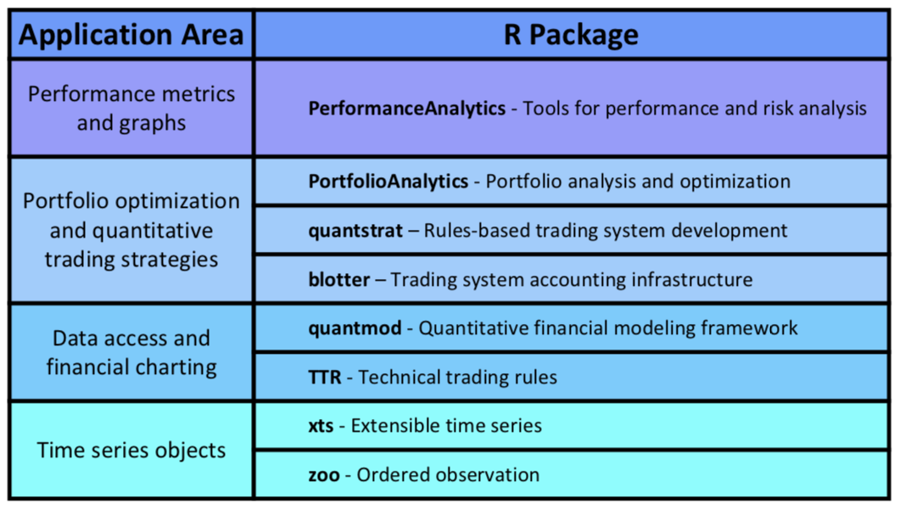

```{r setup, include=FALSE}
options(htmltools.dir.version = FALSE)
# names(xaringan:::list_css())
```

class: inverse, center, middle

# 1/4  简介

---
## 如何开始

.pull-left[
首先从 [CRAN](https://cran.r-project.org/web/packages/pedquant/index.html) 安装 **pedquant** (**P**ublic **E**conomic **D**ata and **Quant**itative Analysis) 包：
```r
install.packages('pedquant')
```

或者从 [GitHub](https://github.com/ShichenXie/pedquant) 安装最新版：
```r
devtools::install_github('shichenxie/pedquant')
```

**pedquant** 包的帮助文档参见 http://pedquant.com ， 
或查看R中相应的文档：
```r
help(package = 'pedquant')
```

]
.pull-right[
**pedquant** 包提供的函数主要分为三大类：

1. **ed_** (**e**conomic **d**ata 的缩写) 开头的函数，获取来自 [美联储经济数据 FRED](https://research.stlouisfed.org/)、 [中国人民银行 PBC](http://www.pbc.gov.cn/) (进行中)、 [国家统计局 NBS](http://data.stats.gov.cn/) 等机构的经济社会统计数据；

2. **md_** (**m**arket **d**ata 的缩写)开头的函数，获取来自 [雅虎财经 yahoo](https://finance.yahoo.com/) 的全球股票价格数据、 [网易财经 163](http://quotes.money.163.com/) 的上证与深证股票价格与财报数据、 [新浪财经 sina](https://finance.sina.com.cn/futuremarket/) 的国内期货价格数据等；

3. **pq_** (**p**ed**q**uant 的缩写)开头的函数，主要提供了一些数据预处理与可视化等相关功能。
]

---
## 相关R包

.pull-left[
- 常用的量化分析 R 包见下表<sup>*</sup>:


]

.pull-right[
- 左侧列出的 R 包大部分基于 xts (可扩展时间序列) 数据结构。

- 但以 data.frame (数据框) 为基础的数据处理工具包，例如 [tidyverse](http://tidyverse.org)、 [data.table](http://r-datatable.com)，更为大家所熟悉。[tidyquant](https://github.com/business-science/tidyquant) 将量化分析常用功能与 [tidyverse](http://tidyverse.org) 很好的结合起来。

- [pedquant](https://github.com/shichenxie/pedquant) 提供了类似于 [quantmod](https://github.com/joshuaulrich/quantmod) 的功能，但是基于 [data.table](http://r-datatable.com) 包开发，而且提供了我国所特有的财经数据。

]


.footnote[[*] 参考 [Guy Yollin. Introduction to Trading Systems](http://www.r-programming.org/papers)。]

---

class: inverse, center, middle

# 2/4 获取数据


---
## 经济社会统计数据

- `ed_nbs` 函数可查询国家统计局 NBS 数据（以 `ed_` 开头的函数可以不用输入参数，而通过交互的方式设定）。
- 其中，`symbol` 与 `subregion` 两个参数可分别通过 `ed_nbs_symbol` 与 `ed_nbs_subregion` 函数获得。

```{r dt_nbs}
library(data.table)
library(pedquant)
packageVersion('pedquant')
# cpi of China
dt_nbs = ed_nbs(symbol = c('A01010101','A01010201'), freq = 'monthly',
               geo_type = 'nation', date_range = 'max', na_rm = TRUE)
# data sturcture
str(dt_nbs)
```


---
class: clear 

- `ed_fred` 函数可获取美联储经济数据 FRED。目前该数据库覆盖了87个数据源，拥有53万个美国或国际的数据指标。
- 其中，`symbol` 参数可以通过 `ed_fred_symbol` 函数获取，或者到 FRED 网站上查询。

```{r dt_fred}
# cpi of US
dt_fred = ed_fred(symbol = 'FLEXCPIM159SFRBATL', date_range = 'max', print_step=0)
# data sturcture 
str(dt_fred)
```


---
## 市场数据

- `md_stock` 函数能够通过雅虎财经查询 [全球上市公司](https://help.yahoo.com/kb/finance-for-web/SLN2310.html?impressions=true) 的股价历史数据，或通过网易财经查询A股上市公司的股价历史数据。
- 雅虎财经提供的历史数据剔除了拆分的影响。网易财经提供的是原始数据，本项目默认对拆分进行了复权。如果需要对分红进一步复权，需要设置adj为TRUE。（复权方法主要参考了 [wind复权算法说明](http://180.96.8.19/windnet/Bulletin/express/fqsf.pdf)）
.pull-left[
```{r}
dt_yahoo = md_stock('000001', date_range = 'max', print_step=0)
str(dt_yahoo[[1]][.N])
```
]
.pull-right[
```{r}
dt_163 = md_stock('000001', source = '163', date_range = 'max', print_step=0)
str(dt_163[[1]][.N])
```
]

---
class: clear
.pull-left[
- 获取A股上市公司财报，包括
  - 财务报表：摘要/利润表/资产负债表/现金流量表
  - 与财务指标：主要财务指标/盈利能力/偿还能力/成长能力/营运能力

```{r fs}
dt_fs = md_stock_financials(
  '000001', type='f', print_step=0)
t(dt_fs[[1]][1:2])
```

- 1.杜邦分析
  - 资产收益率ROE = 总资产收益率ROA * 1/(1-资产负债率asset_liability) 
  - 其中，总资产收益率ROA = 销售净利率profit_margin * 总资产周转率asset_turnover

]

.pull-right[
- 2.主要财务指标

<style>
table th:nth-of-type(1) {
	width: 28%;
}
table th:nth-of-type(2) {
	width: 22%;
}
table th:nth-of-type(3) {
	width: 28%;
}
table th:nth-of-type(4) {
	width: 22%;
}
</style>

指标                 | 英文缩写   | 指标                 | 英文缩写   
:------               | :----     | :------               | :----
每股收益(元)         | EPS        | 净利润同比(%)        | NPYOY
营业收入(万元)       | revenue    | 净利润环比(%)        | NPQOQ
营业收入同比(%)	     | revenueYOY | 每股净资产(元)       | BVPS
营业收入环比(%)	     | revenueQOQ | 净资产收益率(%)	     | ROE_w
净利润(万元)         | NP         | 每股经营现金流量(元) | CFPS 

```{r}
dt_smy = md_stock_financials(
  '000001', type='summary')
```

           

]

---
class: clear

- 在历史股价中添加常用的估值指标
  - 市净率PB  = 每股价格/每股净资产BVPS
  - 市盈率PE  = 每股价格/每股收益EPS
  - 市销率PS  = 每股价格/每股销售收入SPS
  - 市现率PCF = 每股价格/每股现金流CFPS

```{r val}
dt_val = md_stock('000001', date_range='max', source='163', valuation=TRUE, print_step=0)
tail(dt_val[[1]], 3)
```


---
class: inverse, center, middle

# 3/4 数据预处理与可视化

---
## 技术分析指标


.pull-left[
- `pq_addti` 函数对TTR包的函数进行了适当封装，便于创建技术分析指标。

```{r}
dt_ti = pq_addti(dt_163, 
    sma = list(n=20), sma = list(n=50), 
    macd = list(), col_kp = FALSE)

tail(dt_ti[[1]],2)
```
]
.pull-right[
- 指标类别：
  - 根据指标功能可分为移动平均/趋势检测或强度指标/震荡指标/波动率指标/成交量指标/其它
  - 根据指标的值大小分为overlays/indicators。
  
- TTR函数参数：
  - 价格/成交量/权重：
      - 不可修改参数，包括OHLC, HLC, HL and volume；
      - 可修改参数，包括price, prices, x。 均默认设为close或value；
      - 需要单独设置参数，包括y, w；
  - 数值参数：例如n, sd, v, nFast, nSlow, nSig, accel，均有默认值，但可以根据需要修改。
]


---
## 可视化
.pull-left[
```{r p1, fig.asp=0.8}
# line chart
p1 = pq_plot(rbindlist(dt_nbs)[, symbol := symbol[.N]], 
    from = '2000-1-1', chart_type = 'step')
print(p1$A01010201)
```

]
.pull-right[
```{r p2, fig.asp=0.8}
# candlestick chart

p2 = pq_plot(dt_val, date_range = 'ytd', 
    chart_type = 'candle')
```
]

---
class: clear
.pull-left[
```{r p3, fig.asp=0.8}
# addti
p3 = pq_plot(dt_val, date_range = 'ytd', 
    chart_type = 'bar', addti = list(
        sma = list(n=20), sma = list(n=50), 
        pb=list()))
```

]
.pull-right[
```{r p4, fig.asp=0.8}
# linear_trend 

p4 = pq_plot(dt_val, date_range = 'max', 
    chart_type = 'line',
    linear_trend = c(-0.8, 0, 0.8))
```
]

---
class:clear

```{r p5, fig.asp=0.4, fig.width=14, fig.align='center'}
# multiple series
dat = md_stock(c('^000001', '^399001'), 
               date_range = 'max', source = '163', print_step = 0)

p5 = pq_plot(dat, multi_series = list(ncol=2, scales='free_y'), date_range = 'max', 
        linear_trend = c(-0.8, 0, 0.8), yaxis_log = TRUE)
print(p5$multi_series)
```

---
class: inverse, center, middle

# 4/4 策略开发

---
## 双均线策略

.pull-left[
```{r}
# load data
ssec = md_stock('^000001', source='163', date_range = 'max', print_step = 0)

# technical indicators
ti = list(
    sma=list(n=40), 
    sma=list(n=60),
    runmin = list(n=30))

# long strategy
long = list(
    enter = 'co(sma_40, sma_60)',
    exit  = 'co(sma_60, sma_40)',
    stop_limit = 'close == runmin_30',
    price = 'close', position = 100
)

```
]


.pull-right[
```{r, fig.asp=0.8, message=FALSE, warning=FALSE}
w = pedquant:::pq_backtest(ssec, addti=ti, 
    rule=list(long=long), stp_lmt_pct=0.03)
```
]

---
class: inverse, center, middle


